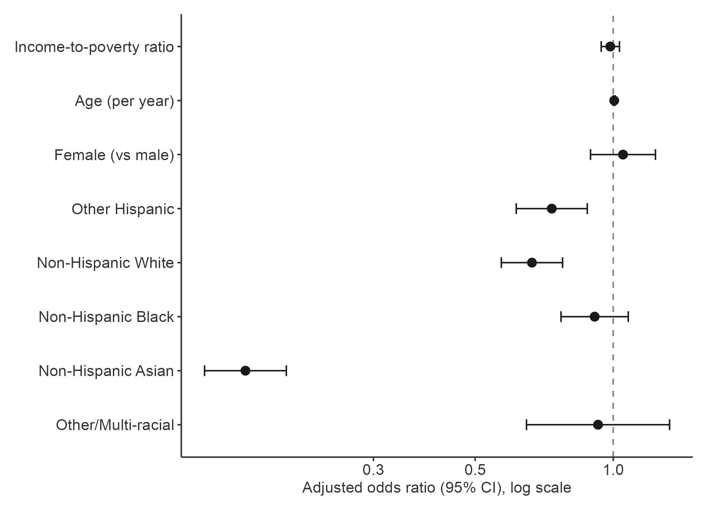
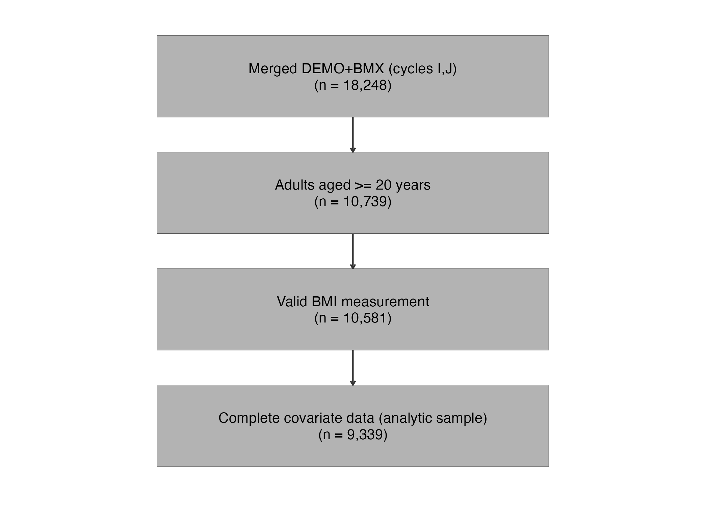

# NHANES Assistant

An MCP-server-based research engine that answers questions about **NHANES** (the U.S. National Health and Nutrition Examination Survey) with complex-survey statistical rigor and manuscript-ready output. It runs in both **Claude Code** and **Antigravity** from the same code.

The agent **writes R code; R executes it.** Every statistic in the output is computed by the `survey` package — not produced by a language model — so the numbers are real, reproducible, and auditable.

> **Responsible use.** This is a research-assistant tool, not a substitute for a qualified statistician or epidemiologist. Always review the generated R script (saved with every run), confirm the variable and weight choices, and verify the results before citing or publishing. Survey-weighted code that *runs* is not necessarily code that is *correctly specified*.

---

## What it does

Ask a question in plain language; the orchestrator classifies it and routes:

- **Quick path** — variable/codebook lookups, cycle availability, weighted descriptive statistics, trend figures. Returns styled HTML figures/tables + a short summary.
- **Full path** — a hypothesis → manuscript pipeline:
  1. **Data Harmonizer** maps variables, picks the weight, flags cross-cycle issues, and returns a research plan **for your approval before any data is downloaded**.
  2. **Statistician** generates and executes survey-weighted R (Table 1, models, figures), retrying autonomously on errors.
  3. **Manuscript Writer** drafts Abstract / Methods / Results / Limitations + recommended figure & table legends.
  4. **Peer Reviewer** checks the draft against the full **STROBE-nut** checklist, looping up to 15 times until it passes.
  5. Final delivery: a formatted **`.docx`** with embedded 300 DPI figures and tables, plus a reproducibility ZIP (`.docx` + R scripts + CSVs + HTML).

### Built-in epidemiological guardrails
- Excludes the 2019–2020 cycle (COVID-disrupted); flags 2021–2022 as partial-year.
- Combined-cycle weights recalculated as `WTxxx / n_cycles` before `svydesign()`.
- `options(survey.lonely.psu = "adjust")`; `id=~SDMVPSU, strata=~SDMVSTRA, nest=TRUE`; Taylor-series linearization.
- Complete-case analysis with pre/post Ns; subgroups via `subset()` on the design (never row-dropping).
- Weight-selection hierarchy by lowest selection probability (dietary > subsample > MEC > interview).
- Dietary analyses: Goldberg misreporter cutoffs and energy adjustment (residual or density).

## Output styling
- **Arial**, grayscale palette, no gridlines (axis lines only). Forest plots keep a dashed null reference line; other figure types do not.
- HTML tables: charcoal `#333333` headers, white text, zebra striping. `.docx` tables via `flextable`; figures at 300 DPI via `ragg`.

---

## Example output

These are produced by the plugin from a real Full-path run — *"Is family income associated with obesity in US adults?"* (NHANES 2015–2016 and 2017–2018, N = 9,339 adults). The full run also drafts the Abstract/Methods/Results/Limitations and assembles a formatted `.docx` with these figures and the Table 1 / model tables embedded.

**Figure 2 — adjusted odds ratios (forest plot):**



**Figure 1 — participant flow:**



---

## Requirements
- **R** (with `Rscript` on PATH) — the engine. macOS/Linux/Windows.
- **Python 3.11+** — runs the MCP server.
- macOS: [Homebrew](https://brew.sh) (setup installs the font libraries `flextable`/`gdtools` need).

## Install

You can install through the **Claude Code plugin marketplace** (Option A) or by **cloning manually** (Option B).

> **Either way, you must run `setup.sh` after installing.** It builds the Python venv and installs the R packages the MCP server depends on. The plugin's MCP server runs `nhanes_server/venv/bin/python`, which does **not exist** until setup runs — so until then the `/nhanes-assistant` skill loads but its tools will fail. This is not a one-click plugin: R must already be installed (see [Requirements](#requirements)).

### Option A — Claude Code plugin marketplace

```bash
claude plugin marketplace add douglasm-2025/nhanes-assistant-plugin
claude plugin install nhanes-assistant@nhanes-marketplace
```

The plugin is cloned into Claude Code's plugin cache. Build the environment **in that installed copy**, then reload:

```bash
cd ~/.claude/plugins/cache/nhanes-marketplace/nhanes-assistant/*/
bash setup.sh
```

Restart Claude Code (or run `/reload-plugins`) so the MCP server connects. Do not move the installed folder afterward — the venv stores absolute paths.

### Option B — Manual clone

```bash
git clone https://github.com/douglasm-2025/nhanes-assistant-plugin.git
cd nhanes-assistant-plugin
bash setup.sh
```

`setup.sh` creates a Python venv at `nhanes_server/venv/`, installs the Python and R packages, and generates the Word template. **Run it from the plugin's permanent location** — the venv stores absolute paths, so don't move the folder after setup. Then register the MCP server and skill as below.

### Claude Code
1. Register the MCP server (use absolute paths):
   ```bash
   claude mcp add nhanes-assistant -- \
     /ABS/PATH/nhanes-assistant-plugin/nhanes_server/venv/bin/python \
     /ABS/PATH/nhanes-assistant-plugin/nhanes_server/server.py
   ```
   (Equivalent JSON for your Claude Code MCP config:)
   ```json
   {
     "mcpServers": {
       "nhanes-assistant": {
         "command": "/ABS/PATH/nhanes-assistant-plugin/nhanes_server/venv/bin/python",
         "args": ["/ABS/PATH/nhanes-assistant-plugin/nhanes_server/server.py"]
       }
     }
   }
   ```
2. Install the skill so `/nhanes-assistant` is available:
   ```bash
   mkdir -p ~/.claude/skills/nhanes-assistant
   cp skills/nhanes-assistant/SKILL.md ~/.claude/skills/nhanes-assistant/
   ```
   (Or copy into a project's `.claude/skills/` for project scope.)

See [`docs/mcp-setup.md`](docs/mcp-setup.md) for details and troubleshooting.

### Antigravity
`plugin.json` is the Antigravity manifest — it registers the MCP server and the skill. Place this folder where Antigravity loads plugins (or import it via Antigravity's plugin manager, pointing at `plugin.json`), then run `setup.sh` once. Consult your Antigravity version's plugin docs for the exact plugins directory.

## Use
In Claude Code: `/nhanes-assistant <your question>` — e.g.
```
/nhanes-assistant Is family income associated with obesity in US adults?
```
The orchestrator announces its Quick/Full routing and, on the Full path, waits for you to approve the research plan before downloading data. First-time downloads of a NHANES table can take a few minutes.

## Layout
```
plugin.json                       Antigravity manifest
setup.sh                          venv + R packages + Word template
STROBE-nut_checklist.docx         Source for the peer reviewer's checklist
nhanes_server/
  server.py                       FastMCP server (11 tools, 5 resources)
  r_helpers/                      ggplot theme + gt/flextable styles; template generator
agents/                           5 agent definitions (harmonizer, statistician, writer, reviewer, quick analyst)
skills/nhanes-assistant/SKILL.md  Orchestrator (triage + 15-loop peer review)
docs/mcp-setup.md                 Claude Code connection guide
tests/                            Server unit tests + R style tests
```

## Notes & limits
- The `.docx` author line is intentionally blank — fill it in before submission. Continuous line numbering is enabled in Word (officer cannot set it programmatically).
- NHANES is cross-sectional: outputs use associational, non-causal language by design.

## Data source & license
NHANES public-use data are freely available from the CDC/NCHS: https://www.cdc.gov/nchs/nhanes. This tool downloads them at runtime via the [`nhanesA`](https://cran.r-project.org/package=nhanesA) R package. Add your own license file before publishing.
